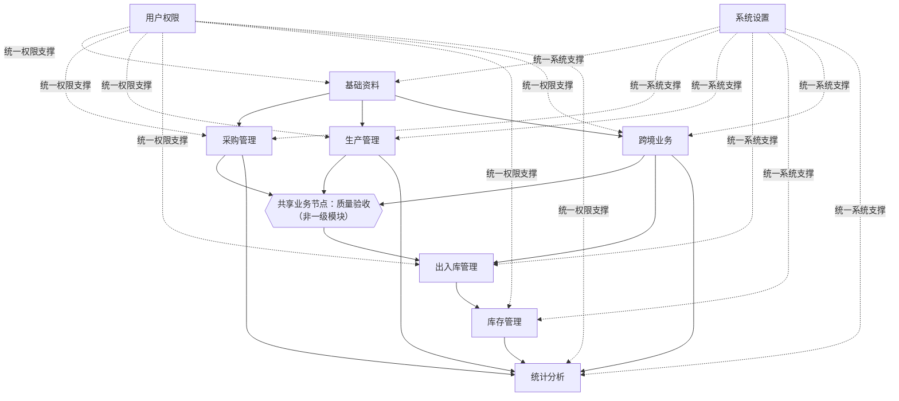

# Task 2.3：模块关系设计

## 1. 任务范围

本任务负责明确九个一级模块之间的模块关系、业务流、单据流、库存流、支撑关系和共享业务节点。

本任务不包含数据库设计、字段设计、页面设计、API 设计、技术架构或编码。

## 2. 核心设计原则

1. 九个一级模块保持不变；
2. 采购管理与生产管理平行，不存在上下级关系；
3. 质量验收是采购到货和委外生产完工共用的业务节点；
4. 库存状态与库存变化分离，库存管理负责状态，出入库管理负责变化；
5. 所有库存变化必须由正式单据触发并生成库存流水（Inventory Ledger）；
6. 用户权限和系统设置为全部模块提供统一支撑；
7. 统计分析原则上只读取正式业务数据，不反向修改业务数据。

## 3. 一级模块关系

九个一级模块固定为：基础资料、采购管理、生产管理、库存管理、出入库管理、跨境业务、统计分析、用户权限和系统设置。“出入库管理”名称保持不变。

采购管理和生产管理在图中保持平行，彼此不生成单据。质量验收是共享节点而非新增一级模块。跨境业务通过出入库管理产生正式库存变化；用户权限和系统设置为全部模块提供统一支撑。

## 4. 国内直接采购业务流

确认采购需求
→ 创建采购单
→ 单级审核
→ 供应商发货
→ 到货登记
→ 质量验收
→ 合格品采购入库
→ 更新公司仓库存
→ 记录采购付款
→ 统计分析

异常流程：

验收不合格
→ 采购退货 / 补货 / 待处理

直接采购由采购管理独立完成，不进入委外生产流程。

## 5. 委外生产业务流

确认委外生产需求
→ 创建委外生产单
→ 单级审核
→ 厂家生产
→ 更新生产进度
→ 分批或全部完工
→ 质量验收
→ 合格品进入公司仓或厂家仓
→ 更新库存
→ 统计分析

委外生产由生产管理独立完成，委外生产单不依赖采购单。

## 6. 国内销售出库业务流

取得平台订单
→ 创建销售出库单
→ 记录平台和订单号
→ 校验可用库存
→ 单级审核
→ 仓库出库
→ 扣减公司仓库存
→ 生成库存流水
→ 统计分析

本期不建设完整销售订单，国内电商按照平台订单逐单登记出库。库存不足不得完成出库。

## 7. 跨境发货业务流

委外生产完成
→ 质量验收
→ 合格品进入厂家仓
→ 创建跨境发货单
→ 选择厂家仓库存
→ 单级审核
→ 厂家发货
→ 减少厂家仓库存
→ 增加在途库存
→ 记录物流状态
→ 导入海外仓 Excel
→ 更新海外仓库存
→ 处理发出与实收差异
→ 统计分析

同时保留公司仓跨境发货的业务可能性：

公司仓库存
→ 跨境发货出库
→ 在途库存
→ 海外仓库存

跨境业务必须通过出入库管理影响厂家仓、公司仓、在途和海外库存。

## 8. 单据流

### 8.1 直接采购

采购单
→ 到货记录
→ 质量验收记录
→ 采购入库单
→ 库存流水
→ 采购付款记录

### 8.2 委外生产

委外生产单
→ 生产进度记录
→ 分批完工记录
→ 质量验收记录
→ 生产入库单
→ 库存流水

### 8.3 国内销售

平台订单号
→ 销售出库单
→ 出库确认
→ 库存流水

### 8.4 跨境发货

委外生产单或跨境采购单
→ 厂家仓入库记录
→ 跨境发货单
→ 厂家仓出库单
→ 在途库存记录
→ 海外库存导入批次
→ 海外库存更新记录
→ 差异处理记录

### 8.5 调拨

调拨单
→ 调出确认
→ 调拨出库流水
→ 在途库存
→ 调入确认
→ 调拨入库流水

### 8.6 盘点

盘点任务
→ 账面库存快照
→ 实盘结果
→ 差异确认
→ 库存调整单
→ 库存流水

## 9. 库存流

### 9.1 国内采购库存流

供应商
→ 到货待验
→ 质量验收
→ 公司仓正常库存
→ 国内销售出库
→ 客户或平台

### 9.2 委外生产进入厂家仓

厂家生产
→ 完工待验
→ 质量验收
→ 对应厂家仓库存
→ 跨境分批发货
→ 在途库存
→ 海外仓库存

### 9.3 不合格品

质量验收不合格
→ 待处理库存
→ 退货 / 返工 / 报损

### 9.4 销售退货

客户退回
→ 退货验收
→ 可销售：公司仓正常库存
→ 不可销售：待处理库存

## 10. 质量验收共享节点

质量验收至少服务于采购到货和委外生产完工。

质量验收输出：

- 合格数量；
- 不合格数量；
- 待处理数量；
- 不合格原因；
- 处理方式；
- 验收人；
- 验收时间。

归属规则：

- 一级菜单职责仍归入生产管理；
- 在业务流程中作为采购和生产共用节点；
- 不建立两套冲突的验收规则；
- 不新增质量验收一级模块；
- 验收合格后，商品才能进入正常库存。

## 11. 不采用的方案

### 11.1 不采用采购单生成生产单

原因：

- 采购和生产是平行业务；
- 直接采购不存在生产环节；
- 强制串联会造成重复单据。

### 11.2 不采用生产单强制关联采购单

原因：

- 委外生产单可完整表达厂家、产品、数量、单价和交期；
- 不符合轻量级 ERP 定位。

### 11.3 不新增质量验收一级模块

原因：

- 当前业务规模不需要；
- 质量验收作为共享业务节点即可。

### 11.4 不合并库存管理与出入库管理

原因：

- 库存管理负责库存状态；
- 出入库管理负责库存变化。

### 11.5 不新增数据中心一级模块

原因：

- Excel 导入和初始化属于系统工具；
- 统一归入系统设置。

## 12. Task 2.3最终确认事项

1. 采购管理与生产管理为平行模块；
2. 采购单不生成生产单；
3. 生产单不要求先创建采购单；
4. 直接采购由采购管理独立完成；
5. 委外生产由生产管理独立完成；
6. 质量验收是采购和生产共用节点；
7. 质量验收不新增一级模块；
8. 验收合格后才能进入正常库存；
9. 出入库管理负责所有正式库存变化；
10. 库存管理负责当前库存状态；
11. 跨境业务通过出入库管理影响厂家仓、在途和海外库存；
12. 统计分析只读取正式业务数据；
13. 用户权限和系统设置为全部模块提供支撑；
14. 调拨必须经过在途状态；
15. 国内销售只建立销售出库单；
16. 九个一级模块保持不变。

Task 2.3 状态：Completed / Approved。

Task 2.4 核心业务流程设计状态：Not Started。本文件不包含 Task 2.4 正文。
