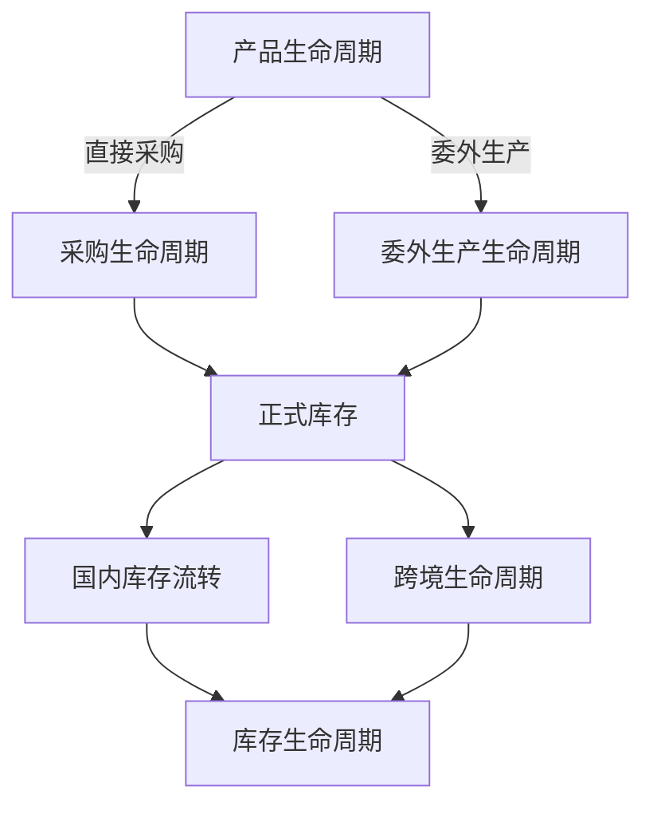

# Task 2.4：业务生命周期设计（Business Lifecycle Design）

## 1. 任务信息

| 项目 | 内容 |
| --- | --- |
| 所属阶段 | Phase 2：业务流程设计 |
| 当前任务 | Task 2.4：业务生命周期设计 |
| 前置任务 | Task 2.1 系统模块划分、Task 2.2 模块职责设计、Task 2.3 模块关系设计 |
| 文档状态 | Approved |
| 本任务范围 | 明确产品、采购、委外生产、跨境和库存五类核心业务对象从开始到结束的完整生命周期 |
| 本任务不包含 | Task 2.5 状态流转详细设计、状态字段和状态枚举、数据库表和字段、页面设计、API 设计、技术架构及技术实现 |

本任务不是重复 Phase 1 的基础业务流程，而是明确核心业务对象从启动、执行、异常处理到完成或退出的完整生命周期。

## 2. 设计目标

生命周期设计用于回答：

- 业务从哪里开始；
- 业务经历哪些阶段；
- 哪些模块参与；
- 哪些控制节点不可跳过；
- 正常完成需要满足哪些条件；
- 异常发生后如何处理；
- 后续状态流转规则应如何从业务阶段推导。

本文件是以下后续工作的业务依据：

- Task 2.5 状态流转设计；
- Task 2.6 输入输出分析；
- Phase 3 数据库设计；
- Phase 6 功能详细设计。

## 3. 生命周期设计原则

1. 生命周期与模块不同：生命周期可以跨越多个一级模块，不以模块边界代替业务的开始和结束；
2. 生命周期与单据不同：一个生命周期可以包含多张正式单据，单张单据也可能只承担其中一个业务节点；
3. 每条生命周期必须具有启动条件、正常路径、异常路径和完成条件；
4. 生命周期不得绕过单级审核、质量验收、正式出入库和库存流水；
5. 所有库存变化必须可追溯至正式业务单据和操作记录；
6. 采购管理与生产管理继续保持平行关系，采购单不生成生产单，委外生产单不依赖采购单；
7. 本任务不新增一级模块；
8. 本任务只描述业务生命周期，不进入正式状态机、状态枚举或数据库设计。

## 4. 产品生命周期

### 4.1 生命周期定位

产品生命周期描述一个产品或 SKU 从建档、启用、采购或生产、验收、库存流转、销售或跨境发货，直至停用的全过程。

本期按照产品、SKU 和批次数量管理，不管理单把小提琴的独立序列号生命周期。

### 4.2 产品生命周期总图

提出产品建档需求
→ 建立产品资料
→ 建立或校验 SKU
→ 审核启用
→ 进入直接采购或委外生产
→ 质量验收
→ 进入正式库存
→ 国内销售 / 跨境发货 / 内部领用
→ 销售退货 / 调拨 / 盘点 / 报损
→ 持续经营
→ 产品停用
→ 保留历史记录

### 4.3 产品生命周期阶段

1. 产品建档：收集并维护标准产品与 SKU 资料；
2. 产品启用：审核资料完整性后允许用于新增业务；
3. 产品获取：通过直接采购或委外生产获得产品；
4. 质量验收：采购到货或生产完工后执行统一质量验收；
5. 正式库存：合格数量通过正式入库进入公司仓或厂家仓；
6. 库存流转：支持销售、跨境发货、调拨、退货、盘点、领用和报损；
7. 产品停用：停止新增业务并保留全部历史记录。

### 4.4 产品生命周期规则

- 产品和 SKU 启用后方可用于新增业务；
- 停用后不得创建新业务；
- 停用前已经存在的未完成业务仍可继续处理直至闭环；
- 已产生业务记录的产品不得物理删除；
- 套装作为独立 SKU 整体管理；
- 不建立第二套平行产品资料。

### 4.5 产品生命周期异常路径

#### 产品或 SKU 重复

发现与正式产品资料重复
→ 停止新增
→ 校验并引用现有正式档案

#### 停用产品存在未完成业务

产品已经停用
→ 禁止创建新业务
→ 继续处理停用前已存在的未完成业务
→ 保留历史记录

#### 停用产品仍有库存

产品停止经营但库存未清零
→ 通过销售、退货、调拨、领用或报损等正式业务完成处置
→ 生成对应库存流水

### 4.6 产品生命周期完成条件

产品生命周期结束需同时满足：

- 产品已经停止经营；
- 未完成订单已经处理；
- 库存已经清零或完成正式处置；
- 产品状态已经停用；
- 历史业务、库存流水和操作记录继续保留。

## 5. 采购生命周期

### 5.1 生命周期定位

采购生命周期适用于成品采购、配件采购、包装材料采购和其他外购物资。采购单不生成生产单，直接采购由采购管理独立完成。

### 5.2 采购生命周期总图

确认采购需求
→ 创建采购单
→ 单级审核
→ 供应商备货或发货
→ 到货登记
→ 质量验收
→ 合格品分批或全部入库
→ 记录采购付款
→ 处理退货、补货或差异
→ 采购订单完成

### 5.3 采购生命周期阶段

1. 确认采购需求；
2. 创建采购单；
3. 采购审核；
4. 供应商交付；
5. 到货和质量验收；
6. 采购入库；
7. 采购付款；
8. 采购完成。

以上为生命周期业务阶段，不构成 Task 2.5 的正式状态枚举或转换规则。

### 5.4 采购需求处理

- 本期不建立独立采购需求模块；
- 采购人员直接创建采购单；
- 采购需求可来源于安全库存不足、经营备货、配件补充或管理安排。

### 5.5 分批规则

采购支持：

- 分批到货；
- 分批验收；
- 分批入库；
- 部分退货；
- 多次付款。

系统需分别记录订单数量、到货数量、验收数量、入库数量和未交数量，不得互相代替。

### 5.6 采购付款规则

- 付款状态独立于采购业务状态；
- 商品业务可以完成但仍未付清；
- 付款状态包括未付款、部分付款和已付清；
- 付款记录不替代财务软件；
- 付款状态不直接决定采购业务是否完成。

上述付款状态沿用 Frozen 业务规则中的既有结算状态，不在本任务设计新的正式状态机。

### 5.7 采购异常路径

#### 验收不合格

质量验收不合格
→ 退供应商 / 要求补货 / 待处理

#### 少交

实际到货少于订单数量
→ 保留剩余未交
→ 等待后续交付

或：

实际到货少于订单数量
→ 正式取消剩余数量

#### 多交

实际到货超过订单数量
→ 拒收

或：

实际到货超过订单数量
→ 正式确认增量

不得静默超订单入库。

#### 采购退货

发现质量问题
→ 创建采购退货
→ 单级审核
→ 采购退货出库
→ 供应商退款或补货
→ 关闭退货业务

### 5.8 采购完成条件

采购完成需同时满足：

- 业务数量已经闭环；
- 到货已经验收；
- 合格数量已经入库；
- 不合格数量已经处理；
- 未交数量为零或已经正式取消；
- 不存在待处理异常。

## 6. 委外生产生命周期

### 6.1 生命周期定位

委外生产适用于公司直接委托生产厂家生产小提琴或其他乐器产品。委外生产由生产管理独立完成，委外生产单不依赖采购单。

### 6.2 委外生产生命周期总图

确认委外生产需求
→ 创建委外生产单
→ 单级审核
→ 厂家生产
→ 更新生产进度
→ 分批或全部完工
→ 质量验收
→ 合格品进入公司仓或厂家仓
→ 不合格品返工、退货或待处理
→ 委外生产单完成

### 6.3 生命周期阶段

1. 确认生产需求；
2. 创建委外生产单；
3. 生产审核；
4. 厂家生产；
5. 分批完工；
6. 质量验收；
7. 入库地点判断；
8. 付款与结算；
9. 委外生产完成。

### 6.4 生产范围边界

本期不管理：

- 工序级生产；
- 设备排产；
- 工人计件；
- 复杂 BOM；
- MRP；
- 单把琴序列号。

### 6.5 生产进度阶段

生命周期层面的业务阶段可包括：

- 待生产；
- 已排产；
- 生产中；
- 部分完工；
- 已完工；
- 暂停；
- 异常。

以上仅为生命周期阶段描述，不构成正式状态枚举、状态机或转换条件；正式状态及转换规则由 Task 2.5 确定。

### 6.6 分批完工规则

系统需分别记录：

- 计划数量；
- 本次完工数量；
- 累计完工数量；
- 剩余未完工数量。

委外生产支持分批完工、分批验收和分批入库。

### 6.7 质量验收和入库地点

质量验收合格品可以进入公司仓或对应厂家仓。

通常情况下：

- 国内销售备货进入公司仓；
- 跨境备货进入对应厂家仓。

最终入库地点以实际业务选择和正式入库单为准。未经验收或验收不合格的数量不得进入正常库存。

### 6.8 委外生产付款规则

- 委外生产可以沿用采购付款记录能力；
- 付款状态与生产进度分离；
- 付款状态不决定生产业务是否完成。

### 6.9 委外生产异常路径

#### 生产延期

预计日期到期
→ 尚未完成
→ 标记逾期
→ 更新预计完工日期
→ 保留异常记录

#### 部分完工

部分完工
→ 分批验收
→ 分批入库
→ 订单继续生产

#### 验收不合格

验收不合格
→ 返工
→ 再次完工
→ 再次验收

或：

验收不合格
→ 正式取消该部分数量
→ 结束异常处理

### 6.10 委外生产完成条件

委外生产完成需同时满足：

- 计划数量全部完成或正式取消；
- 完工数量全部验收；
- 合格数量已经入库；
- 不合格数量已经处理；
- 剩余未完工数量为零；
- 无待处理异常。

## 7. 跨境生命周期

### 7.1 生命周期定位

跨境生命周期描述产品从厂家仓或公司仓发出，经过在途，最终进入海外仓库存的全过程。

本期不管理 Amazon、Temu 等平台的完整海外销售订单生命周期。

### 7.2 跨境生命周期总图

跨境备货完成
→ 商品进入厂家仓或公司仓
→ 创建跨境发货单
→ 单级审核
→ 分批发货
→ 国内仓或厂家仓出库
→ 进入在途库存
→ 记录物流状态
→ 海外仓 Excel 定期导入
→ 确认海外库存
→ 处理发出与实收差异
→ 跨境发货批次完成

### 7.3 生命周期阶段

1. 跨境备货；
2. 厂家仓或公司仓存放；
3. 创建跨境发货单；
4. 跨境审核；
5. 分批发货；
6. 进入在途库存；
7. 海外库存导入；
8. 海外收货确认；
9. 差异处理；
10. 跨境批次完成。

以上为生命周期业务阶段，不构成 Task 2.5 的正式状态枚举或转换规则。

### 7.4 跨境备货来源

跨境备货可以来源于委外生产、直接采购或公司仓现有库存。商品必须已经通过质量验收。

### 7.5 分批发货规则

跨境发货支持：

- 一次性发货；
- 多批发货；
- 发往不同海外仓；
- 使用不同物流方式；
- 来源为厂家仓或公司仓。

系统需分别计算可发数量、本次发货数量、累计发货数量和剩余可发数量。

### 7.6 在途库存规则

国内发货完成后必须：

- 减少来源仓库存；
- 增加在途库存；
- 生成库存流水；
- 保存物流信息。

不得从来源仓直接同时增加至海外仓。

### 7.7 海外库存导入规则

海外库存导入必须依次执行：

- 上传；
- 文件校验；
- SKU 匹配；
- 导入预览；
- 人工确认；
- 执行导入；
- 保存导入批次记录；
- 保存成功和失败明细；
- 防止重复导入。

不得自动为无法匹配的数据创建新 SKU。

### 7.8 差异处理

跨境差异至少包括少收、多收、丢失、破损、数据延迟和 SKU 匹配错误。所有差异必须形成明确记录，不得静默处理。

### 7.9 跨境异常路径

#### 长期在途

超过预计到达日期
→ 标记异常
→ 更新物流状态
→ 等待收货或处理

#### 海外少收

海外实收少于发出
→ 形成差异
→ 确认丢失 / 破损 / 数据延迟
→ 正式处理差异

#### Excel 重复导入

上传已处理文件
→ 系统识别重复
→ 阻止再次导入

#### SKU 无法匹配

导入数据无法匹配 SKU
→ 标记失败
→ 人工修正
→ 重新导入

### 7.10 跨境批次完成条件

跨境发货批次完成需同时满足：

- 发货批次已经离开来源仓；
- 在途状态已经结束；
- 海外仓已经确认实收；
- 发出与实收差异已经处理；
- 无待处理异常。

## 8. 库存生命周期

### 8.1 生命周期定位

库存生命周期描述库存从产生、存放、转移、使用、退回、调整到最终消耗或处置的全过程。

### 8.2 库存生命周期总图

期初库存 / 采购入库 / 生产入库 / 退货入库
→ 正常库存
→ 销售出库 / 跨境发货 / 调拨 / 领用
→ 在途库存或库存减少
→ 调入 / 海外收货 / 销售退货
→ 正常库存或待处理库存
→ 盘点 / 调整 / 报损
→ 库存继续流转或最终清零

### 8.3 库存来源

库存来源至少包括：

- 期初库存初始化；
- 采购入库；
- 委外生产入库；
- 销售退货入库；
- 调拨入库；
- 盘盈；
- 其他正式入库。

### 8.4 库存状态

生命周期层面描述的库存状态至少包括：

- 公司仓正常库存；
- 厂家仓库存；
- 海外仓库存；
- 在途库存；
- 待处理库存；
- 可用库存；
- 安全库存状态。

以上仅为生命周期层面的业务状态描述；正式库存状态名称、状态枚举及转换条件由 Task 2.5 确定。

### 8.5 库存增加来源

- 采购入库；
- 生产入库；
- 销售退货入库；
- 调拨入库；
- 盘盈；
- 期初库存；
- 其他正式入库。

### 8.6 库存减少来源

- 销售出库；
- 跨境发货；
- 采购退货；
- 调拨出库；
- 样品出库；
- 活动领用；
- 内部领用；
- 报损；
- 盘亏；
- 其他正式出库。

### 8.7 库存转移

#### 公司仓到在途

公司仓
→ 跨境发货
→ 在途库存

#### 厂家仓到在途

厂家仓
→ 跨境发货
→ 在途库存

#### 在途到海外仓

在途库存
→ 海外收货确认
→ 海外仓库存

#### 仓库间调拨

调出仓
→ 调拨在途
→ 调入仓

### 8.8 库存盘点生命周期

创建盘点任务
→ 形成账面库存快照
→ 实物盘点
→ 录入实盘数量
→ 计算差异
→ 单级审核
→ 生成库存调整单
→ 更新库存
→ 生成库存流水

不得直接覆盖库存余额。

### 8.9 销售退货库存处理

客户退回
→ 退货验收
→ 可销售
→ 返回正常库存

或：

客户退回
→ 退货验收
→ 不可销售
→ 进入待处理库存

### 8.10 待处理库存生命周期

待处理库存来源可以包括：

- 采购验收不合格；
- 生产验收不合格；
- 销售退货不可售；
- 运输破损；
- 盘点异常；
- 待维修商品。

后续必须通过正式业务处理为：

- 返工；
- 退货；
- 整理后转正常库存；
- 报损；
- 其他正式处理。

### 8.11 库存异常路径

#### 库存不足

可用库存不足
→ 阻止出库、调拨或报损完成
→ 等待补货或调整业务数量

#### 账实不符

发现账面库存与实物不一致
→ 创建盘点任务
→ 确认差异
→ 生成库存调整单
→ 生成库存流水

#### 待处理差异

库存存在质量、运输或盘点异常
→ 进入待处理库存
→ 通过返工、退货、转正常库存或报损等正式业务处理

不得直接修改或覆盖库存余额。

### 8.12 库存批次完成条件

单个库存批次完成需同时满足：

- 数量已经全部销售、发出、领用、退货或报损；
- 当前剩余数量为零；
- 库存流水完整；
- 不存在待处理差异。

库存管理模块本身持续运行，不存在整体完成状态。

## 9. 五类生命周期关系

产品通过直接采购或委外生产两条平行路径获取。采购或生产商品通过质量验收和正式入库后进入库存，再根据业务需要进入国内库存流转或跨境生命周期，所有变化最终纳入统一库存生命周期追溯。

## 10. 共享控制节点

### 10.1 单级审核

单级审核适用于：

- 采购单；
- 委外生产单；
- 出入库单；
- 跨境发货单；
- 调拨单；
- 盘点差异；
- 库存调整；
- 报损。

### 10.2 质量验收

采购到货和委外生产完工共用统一验收规则。质量验收不新增一级模块，未经验收或验收不合格的数量不得进入正常库存。

### 10.3 出入库

所有正式库存增加、减少和转移统一通过出入库管理，不得直接修改库存余额。

### 10.4 库存流水

所有库存变化必须生成库存流水，并可追溯至来源单据、业务类型和操作人员。

### 10.5 统计分析

所有生命周期产生的正式业务数据最终可以进入统计分析，但统计分析不得修改原始业务数据，也不得形成第二套库存余额。

## 11. 不采用的方案

### 11.1 不建立独立采购需求生命周期

原因：

- 当前业务规模不需要；
- 增加一层单据和审批会提高操作复杂度；
- 采购和生产人员可以直接创建对应业务单据。

### 11.2 不将采购和生产串联

不采用：

采购单
→ 生产单

原因：

- 两者是平行业务；
- 直接采购不存在生产环节；
- 委外生产不需要重复采购单。

### 11.3 不建设海外销售生命周期

原因：

- 本期不管理 Amazon、Temu 完整销售订单；
- 本期只管理海外库存和跨境发货；
- 海外平台销售暂不纳入完整 ERP 流程。

### 11.4 不管理单琴生命周期

原因：

- 本期不采用单把琴序列号；
- 按照 SKU 和批次数量管理；
- 保持系统轻量化。

### 11.5 不以付款状态决定采购或生产完成

原因：

- 商品业务和资金业务存在时间差；
- 付款状态独立管理更清晰。

## 12. Task 2.4正式确认事项

1. Task 2.4 采用业务生命周期设计；
2. 本期确定产品、采购、委外生产、跨境和库存五类核心生命周期；
3. 产品通过直接采购或委外生产两条平行路径获取；
4. 产品和 SKU 启用后方可进入正式业务；
5. 采购和生产均必须经过质量验收；
6. 只有合格数量可以进入正常库存；
7. 采购支持分批到货、分批验收和分批入库；
8. 委外生产支持分批完工、分批验收和分批入库；
9. 采购付款状态独立于采购业务完成状态；
10. 委外生产付款状态独立于生产进度状态；
11. 跨境发货支持分批、不同海外仓和不同物流方式；
12. 发货后先进入在途库存，再进入海外仓库存；
13. 海外库存通过 Excel 定期导入；
14. 海外发出与实收差异必须处理；
15. 所有库存变化必须经过正式单据并生成库存流水；
16. 库存盘点不得直接覆盖库存余额；
17. 销售退货必须经过退货验收；
18. 不管理完整海外销售订单；
19. 不管理单把小提琴生命周期；
20. 不建立独立采购需求模块。

Task 2.4 状态：Completed / Approved。

Task 2.5 状态流转设计状态：Not Started。本文件不包含 Task 2.5 正文、正式状态枚举或状态转换规则。
