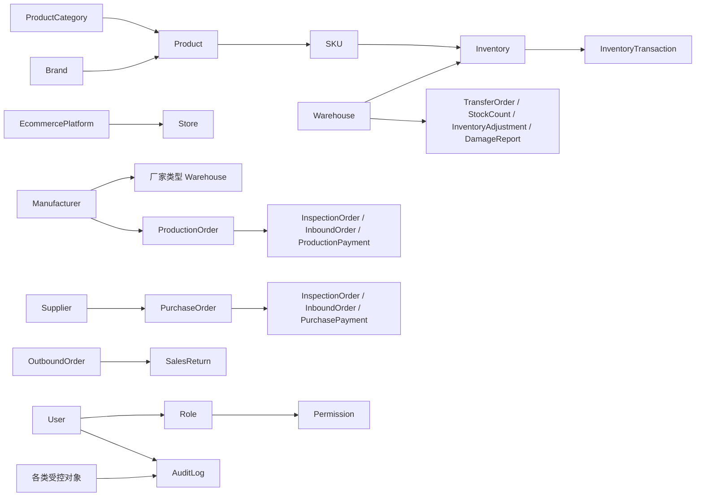

# Task 3.1：业务对象到数据库实体映射（Entity Mapping）

## 1. 任务信息

| 项目 | 内容 |
| --- | --- |
| 所属阶段 | Phase 3：数据库设计（Database Design） |
| 当前任务 | Task 3.1：业务对象到数据库实体映射 |
| 前置任务 | Task 2.6：业务对象定义（Completed / Approved） |
| 文档状态 | Approved |
| 任务状态 | Completed / Approved |
| 下一任务 | Task 3.2：实体关系详细设计（Not Started） |

## 2. 任务范围

本任务只负责：

- 将 Task 2.6 定义的业务对象映射为数据库实体；
- 判断哪些对象需要建立独立实体；
- 判断哪些对象属于计算结果、查询视图或业务概念；
- 明确实体之间的初步概念关系；
- 明确哪些对象不直接建立独立数据表。

本任务不负责：

- 详细字段及字段类型；
- 主键和外键实现；
- 索引；
- SQL；
- 对象关系映射（Object-Relational Mapping，ORM）；
- 数据库技术选型；
- 页面、API 或业务代码；
- 正式实体关系图（Entity Relationship Diagram，ER 图）或物理模型。

## 3. 映射原则

1. 具有独立身份、生命周期和追溯要求的对象建立独立实体。
2. 正式业务单据建立独立主实体，并预留单据明细实体。
3. 仓库子类型不得形成多套平行仓库实体。
4. 库存类型不得形成多套平行库存余额实体。
5. 当前库存与库存流水必须独立。
6. 计算结果、查询结果和报表输出不作为独立业务事实来源。
7. 同一业务事实不得因不同页面或展示口径建立重复实体。
8. 本任务只确认概念实体边界，不确定物理数据库实现。

## 4. 基础对象映射

### 4.1 建立独立实体

| 业务对象 | 概念实体 |
| --- | --- |
| 产品 | `Product` |
| SKU | `SKU` |
| 产品分类 | `ProductCategory` |
| 品牌 | `Brand` |
| 供应商 | `Supplier` |
| 生产厂家 | `Manufacturer` |
| 仓库 | `Warehouse` |
| 电商平台 | `EcommercePlatform` |
| 店铺 | `Store` |

### 4.2 不独立建立实体

- 公司仓作为 `Warehouse` 的一种业务类型表达；
- 厂家仓作为 `Warehouse` 的一种业务类型表达，并与 `Manufacturer` 建立概念关联；
- 海外仓作为 `Warehouse` 的一种业务类型表达；
- 在途库存节点和待处理库存节点通过统一仓库或库存节点机制表达。

### 4.3 必须保留的对象边界

- `Product` 与 `SKU` 独立；
- `Supplier` 与 `Manufacturer` 独立；
- `EcommercePlatform` 与 `Store` 独立；
- 店铺必须归属于平台；
- 每个厂家对应独立厂家仓，不得跨厂家合并库存。

## 5. 正式业务单据实体

以下对象建立独立主实体，并预留对应明细实体：

| 业务对象 | 主实体 |
| --- | --- |
| 采购单 | `PurchaseOrder` |
| 委外生产单 | `ProductionOrder` |
| 质量验收单 | `InspectionOrder` |
| 入库单 | `InboundOrder` |
| 出库单 | `OutboundOrder` |
| 采购付款单 | `PurchasePayment` |
| 生产付款单 | `ProductionPayment` |
| 采购退货单 | `PurchaseReturn` |
| 销售退货单 | `SalesReturn` |
| 跨境发货单 | `CrossBorderShipment` |
| 调拨单 | `TransferOrder` |
| 盘点单 | `StockCount` |
| 库存调整单 | `InventoryAdjustment` |
| 报损单 | `DamageReport` |

统一说明：

- 单据主实体承载单据级业务事实；
- 单据明细实体承载 SKU、数量等行级业务事实；
- 本任务只预留单据明细实体，不命名明细表，也不定义明细字段；
- 所有库存变化必须由正式业务单据触发。

## 6. 库存对象映射

### 6.1 建立独立实体

| 业务对象 | 概念实体 | 定位 |
| --- | --- | --- |
| 库存 | `Inventory` | 当前库存余额的唯一正式来源 |
| 库存流水 | `InventoryTransaction` | 每次库存变化的只追加历史记录 |

统一规则：

- 一个 SKU 在一个库存节点只有一条当前库存记录；
- `Inventory` 是当前库存余额的唯一正式来源；
- `InventoryTransaction` 记录每次库存变化；
- 库存流水只追加，不允许修改或删除；
- 普通用户不得直接修改库存余额。

### 6.2 不建立平行库存余额实体

以下对象通过统一的 `Inventory`、`Warehouse`、库存节点类型、业务来源及后续字段规则表达，不建立独立库存余额实体：

- 可用库存；
- 厂家库存；
- 海外库存；
- 待处理库存；
- 在途库存。

不得建立 `AvailableInventory`、`ManufacturerInventory`、`OverseasInventory`、`PendingInventory` 或 `InTransitInventory` 等平行库存余额实体。

## 7. 导入、预警和备份对象映射

### 7.1 导入任务

建立统一实体 `ImportTask`。海外库存导入任务属于统一导入任务的一种业务类型，当前不建立重复的海外库存导入主实体。

后续如存在海外库存导入专属明细需求，可在后续 Task 中评估扩展实体；本任务不定义相关字段。

### 7.2 库存预警

建立独立实体 `InventoryAlert`，理由如下：

- 低于安全库存是预警的计算触发条件；
- 预警生成、查看、处理、解除和关闭属于需要留痕的业务事实；
- 预警记录不得与实时库存计算混为一体。

### 7.3 数据备份

建立独立实体 `BackupTask`，仅记录备份任务、执行结果和清理历史，不保存实际备份文件内容。

## 8. 系统对象映射

以下系统对象建立独立实体：

| 业务对象 | 概念实体 |
| --- | --- |
| 用户 | `User` |
| 角色 | `Role` |
| 权限 | `Permission` |
| 系统参数 | `SystemSetting` |
| 导入任务 | `ImportTask` |
| 数据备份 | `BackupTask` |
| 统一审计日志 | `AuditLog` |

用户、角色和权限存在概念关联，但具体关联实体、主键、外键及字段留待后续 Task 设计。

## 9. 不直接建立独立实体的对象

### 9.1 统计报表

不建立 `Report` 业务事实实体。统计报表属于基于正式业务数据形成的查询、汇总、看板或导出结果，不得成为平行业务数据源。

### 9.2 业务操作日志

数据库层只建立统一的 `AuditLog`。面向业务人员展示的“操作日志”是统一审计记录的业务查询视图或展示形式，不再建立第二套平行日志实体。

### 9.3 仓库子类型

公司仓、厂家仓、海外仓、在途节点和待处理节点不分别建立独立仓库表。

### 9.4 库存派生概念

可用库存、厂家库存、海外库存、待处理库存和在途库存不分别建立库存余额表。

## 10. 初步实体关系

以下概念关系仅表达对象之间的业务关联，不定义基数、主键、外键字段或物理模型：

概念关系包括：

- `ProductCategory` → `Product` → `SKU`；
- `Brand` → `Product`；
- `EcommercePlatform` → `Store`；
- `Manufacturer` → 厂家类型的 `Warehouse`；
- `SKU` + `Warehouse` → `Inventory`；
- `Inventory` → `InventoryTransaction`；
- `Supplier` → `PurchaseOrder`；
- `Manufacturer` → `ProductionOrder`；
- 采购单、生产单 → 质量验收单、入库单、付款单等后续业务对象；
- `OutboundOrder` → `SalesReturn`；
- `Warehouse` → 调拨、盘点、调整和报损业务；
- `User` → `Role` → `Permission`；
- `User` 和各类受控对象 → `AuditLog`。

## 11. Task 3.1 正式结论

1. 建立统一仓库实体，不分别建立公司仓、厂家仓和海外仓表。
2. 建立统一库存余额实体，不分别建立五类库存余额表。
3. 当前库存与库存流水独立。
4. 所有正式业务单据建立独立主实体，并预留明细实体。
5. 供应商和生产厂家独立。
6. 电商平台和店铺独立。
7. 海外库存导入复用统一导入任务实体。
8. 统计报表不建立业务事实实体。
9. 业务操作日志复用统一审计日志。
10. 库存预警建立独立实体。
11. Task 3.1 不定义字段、主外键、索引、SQL、ORM 和数据库技术选型。
12. Task 3.1 作为后续实体关系和数据表设计的正式输入。

## 12. 状态与后续任务边界

- Phase 2：Completed / Approved；
- Phase 3：In Progress；
- Task 3.1：Completed / Approved；
- Task 3.2：Not Started；
- 数据库详细字段设计：Not Started；
- 技术开发：Not Started。

Task 3.2 尚未启动。本文件不定义详细实体关系、关系基数、数据表、字段、字段类型、主键、外键、索引、SQL、ORM、数据库技术选型、页面、API 或业务代码。
