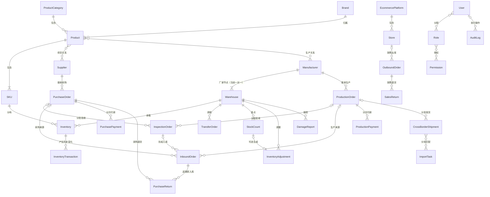

# Task 3.2：实体关系详细设计（Entity Relationship Design）

## 1. 任务信息

| 项目 | 内容 |
| --- | --- |
| 所属阶段 | Phase 3：数据库设计（Database Design） |
| 当前任务 | Task 3.2：实体关系详细设计 |
| 前置任务 | Task 3.1：业务对象到数据库实体映射（Completed / Approved） |
| 文档状态 | Approved |
| 任务状态 | Completed / Approved |
| 下一任务 | Task 3.3：数据表结构设计（Not Started） |

## 2. 任务范围

本任务负责：

- 明确实体之间的一对一、一对多和多对多关系；
- 明确关系方向、业务约束及是否必须关联；
- 明确单据主实体与明细实体关系；
- 明确业务来源和库存变化追溯关系；
- 形成概念级实体关系模型。

本任务不负责：

- 字段名称或字段类型；
- 主键和外键实现；
- 索引；
- SQL；
- 对象关系映射（Object-Relational Mapping，ORM）；
- 数据库技术选型；
- 物理数据表或物理实体关系模型（Entity Relationship Model，ER 模型）；
- 页面、API 或业务代码。

## 3. 关系设计原则

1. 实体关系必须延续 Task 2.3 的模块关系、Task 2.6 的业务对象边界和 Task 3.1 的实体映射结论。
2. 采购与委外生产保持平行，不建立父子关系。
3. 正式业务单据与明细采用一对多主从关系，库存变化必须追溯至来源单据和具体明细。
4. 统一使用 `Warehouse` 表达各类库存节点，统一使用 `Inventory` 表达当前库存余额。
5. 关系基数表达业务约束，不代表已经确定主键、外键或物理实现。
6. 历史关系不得因基础资料停用、单据取消或作废而被物理删除。

## 4. 基础资料关系

| 主实体 | 关系 | 从实体 | 是否必须关联 | 业务规则 |
| --- | --- | --- | --- | --- |
| `ProductCategory` | 一对多 | `Product` | 产品必须关联 | 一个产品归属一个分类，一个分类可包含多个产品 |
| `Brand` | 一对多 | `Product` | 产品必须关联 | 一个产品归属一个品牌，一个品牌可包含多个产品 |
| `Product` | 一对多 | `SKU` | SKU 必须关联 | 一个产品可包含多个 SKU，一个 SKU 只能归属一个产品 |
| `EcommercePlatform` | 一对多 | `Store` | 店铺必须关联 | 一个平台可包含多个店铺，一个店铺只能归属一个平台 |
| `Manufacturer` | 当前一对一、结构允许一对多 | `Warehouse` | 厂家仓必须关联 | 当前每个厂家对应独立厂家仓，结构允许后续扩展多个节点 |
| `Warehouse` | 一对多 | `Inventory` | 库存必须关联 | 一个仓库包含多个 SKU 库存记录 |
| `SKU` | 一对多 | `Inventory` | 库存必须关联 | 一个 SKU 可分布在多个库存节点 |
| `SKU` + `Warehouse` | 唯一业务组合 | `Inventory` | 必须同时关联 | 同一 SKU 在同一库存节点只有一条当前库存记录 |

同时确认：

- `Product` 与 `Supplier` 存在多对多业务关系；
- `Product` 与 `Manufacturer` 存在多对多业务关系；
- 上述多对多关系后续需要关联实体承载供货状态、历史价格、生产能力等关系属性；
- 本任务只确认需要关联实体，不命名关联实体，也不定义其字段。

## 5. 单据主从关系

以下正式业务单据统一采用“单据主实体一对多单据明细实体”的主从结构：

- `PurchaseOrder`；
- `ProductionOrder`；
- `InspectionOrder`；
- `InboundOrder`；
- `OutboundOrder`；
- `PurchaseReturn`；
- `SalesReturn`；
- `CrossBorderShipment`；
- `TransferOrder`；
- `StockCount`；
- `InventoryAdjustment`；
- `DamageReport`。

统一规则：

1. 一张正式业务单据至少包含一条有效明细。
2. 每条明细只能归属于一张主单。
3. 一个 SKU 可以出现在多张单据中。
4. 单据明细不得脱离主单独立存在。
5. 单据主实体与明细实体必须共同保留历史一致性。
6. 付款单是否拆分明细留待后续数据表结构设计，本任务不作强制要求。
7. 本任务不命名单据明细实体，也不定义明细字段。

## 6. 采购业务关系

```text
Supplier
└── PurchaseOrder
    ├── InspectionOrder
    ├── InboundOrder
    ├── PurchaseReturn
    └── PurchasePayment
```

关系规则：

- `Supplier` → `PurchaseOrder`：一对多；
- 一张采购单必须且只能对应一个供应商；
- `PurchaseOrder` → `InspectionOrder`：一对多，支持分批到货和分批验收；
- `InspectionOrder` → `InboundOrder`：一对多，支持分批或分仓入库；
- `PurchaseOrder` → `InboundOrder`：一对多，入库必须追溯采购来源；
- `PurchaseOrder` → `PurchaseReturn`：一对多；
- `InboundOrder` → `PurchaseReturn`：一对多，采购退货必须追溯原入库；
- `PurchaseOrder` → `PurchasePayment`：一对多，支持分次付款；
- `Supplier` → `PurchasePayment`：一对多。

采购与生产边界：

- `PurchaseOrder` 与 `ProductionOrder` 之间不建立父子关系；
- 采购单不得生成生产单；
- 生产单不得强制关联采购单。

## 7. 委外生产关系

```text
Manufacturer
└── ProductionOrder
    ├── InspectionOrder
    ├── InboundOrder
    ├── ProductionPayment
    └── CrossBorderShipment
```

关系规则：

- `Manufacturer` → `ProductionOrder`：一对多；
- 一张生产单必须且只能对应一个生产厂家；
- `ProductionOrder` → `InspectionOrder`：一对多；
- `InspectionOrder` → `InboundOrder`：一对多；
- `ProductionOrder` → `InboundOrder`：一对多；
- `ProductionOrder` → `ProductionPayment`：一对多；
- `ProductionOrder` → `CrossBorderShipment`：一对多；
- `Manufacturer` → 厂家类型 `Warehouse`：当前一对一，结构允许一对多。

付款状态与生产业务状态保持独立，不得互相替代。

## 8. 质量验收关系

采购到货和生产完工统一使用一个 `InspectionOrder` 实体，不分别建立采购验收和生产验收实体。

规则：

1. 一张 `PurchaseOrder` 可关联多张 `InspectionOrder`。
2. 一张 `ProductionOrder` 可关联多张 `InspectionOrder`。
3. 一张 `InspectionOrder` 必须且只能对应一种来源：`PurchaseOrder` 或 `ProductionOrder`。
4. 一张验收单不得同时关联采购单和生产单。
5. 验收合格结果可进入入库业务。
6. 不合格结果可进入待处理、采购退货、返工或报损。
7. 未完成验收不得进入正常可用库存。

验收来源的互斥约束属于概念级业务约束，本任务不定义实现字段或数据库约束。

## 9. 库存和库存流水关系

```text
正式库存业务单据
└── InventoryTransaction
    └── 更新 Inventory
```

关系规则：

- `Inventory` → `InventoryTransaction`：一对多；
- `SKU` → `InventoryTransaction`：一对多；
- `Warehouse` → `InventoryTransaction`：一对多；
- 来源业务单据 → `InventoryTransaction`：一对多；
- 单据明细 → `InventoryTransaction`：一对多；
- 每条库存流水必须追溯具体业务单据及明细；
- 库存流水不得由页面直接操作或无来源操作生成；
- `InventoryTransaction` 只追加，不允许修改或删除；
- `Inventory` 只能由经确认的正式库存业务更新，普通用户不得直接修改。

库存流水来源包括：

- `InboundOrder`；
- `OutboundOrder`；
- `PurchaseReturn`；
- `SalesReturn`；
- `CrossBorderShipment`；
- `TransferOrder`；
- `InventoryAdjustment`；
- `DamageReport`；
- 经确认的海外库存 `ImportTask`。

## 10. 国内销售和退货关系

```text
EcommercePlatform
└── Store
    └── OutboundOrder
        └── SalesReturn
```

规则：

1. 一个店铺可对应多张出库单。
2. 一张销售出库单只对应一个业务来源店铺。
3. 一个出库单可以发生零次或多次销售退货。
4. 一张销售退货单必须关联原 `OutboundOrder`。
5. 可售退货通过入库业务返回正常库存。
6. 不可售退货进入待处理库存节点。
7. 本期不建立完整销售订单实体。
8. 平台订单号仅作为销售出库的外部业务来源信息。

## 11. 跨境发货关系

```text
ProductionOrder
└── CrossBorderShipment
    ├── 来源 Warehouse
    ├── 在途 Warehouse
    ├── 目的海外 Warehouse
    └── ImportTask
```

规则：

1. 一个生产单可对应多张跨境发货单。
2. 一张跨境发货单对应一个来源仓和一个目的海外仓。
3. 来源仓可为厂家仓或公司仓。
4. 一张跨境发货单可以包含多个 SKU 明细。
5. 发货确认后减少来源库存并增加在途库存。
6. 海外接收确认后减少在途库存。
7. 一个海外库存导入任务对应一个海外仓。
8. 一个 `ImportTask` 可匹配多张 `CrossBorderShipment`。
9. 一张 `CrossBorderShipment` 可被多个导入批次逐步确认。
10. `CrossBorderShipment` 与 `ImportTask` 属于多对多业务关系。
11. 后续需要关联实体承载匹配数量、实收数量和差异结果，但本任务不命名关联实体，也不定义字段。

## 12. 调拨关系

```text
TransferOrder
├── 来源 Warehouse
├── 在途 Warehouse
└── 目的 Warehouse
```

规则：

1. 一张调拨单只有一个来源仓和一个目的仓。
2. 来源仓与目的仓不得相同。
3. 一张调拨单可包含多个 SKU。
4. 调出确认后进入在途库存。
5. 调入确认后减少在途库存并增加目的仓库存。
6. 一张调拨单可产生多条调出、在途和调入流水。
7. 调拨必须经过在途状态，不允许直接从来源仓跳转至目的仓。

## 13. 盘点和调整关系

```text
Warehouse
└── StockCount
    └── InventoryAdjustment
        └── InventoryTransaction
```

规则：

1. 一个仓库可对应多张盘点单。
2. 一张盘点单只针对一个库存节点。
3. 一张盘点单包含多个 SKU 盘点明细。
4. 盘点差异不得直接修改 `Inventory`。
5. 一张 `StockCount` 可生成零张或一张 `InventoryAdjustment`。
6. `InventoryAdjustment` 也可以来源于独立纠错原因，不一定必须关联盘点单。
7. 一张库存调整单可以产生多条库存流水。

因此，`StockCount` 与 `InventoryAdjustment` 为可选一对一关系。

## 14. 采购退货、报损和待处理库存关系

### 14.1 采购退货

```text
PurchaseOrder
└── InboundOrder
    └── PurchaseReturn
```

`PurchaseReturn` 必须同时追溯原 `PurchaseOrder` 和原 `InboundOrder`。

### 14.2 报损

```text
Warehouse + SKU
└── DamageReport
    └── InventoryTransaction
```

报损可来源于：

- 正常库存损坏；
- 待处理库存处置；
- 验收不合格处置；
- 销售退货后的不可售处置。

### 14.3 待处理库存

- 不建立独立余额实体；
- 通过统一 `Warehouse` 与 `Inventory` 体系中的待处理库存节点表达；
- 进入和退出必须由正式业务对象驱动。

## 15. 权限关系

`User` 与 `Role` 为多对多关系，`Role` 与 `Permission` 为多对多关系。后续需要用户—角色关联实体及角色—权限关联实体，本任务不命名关联实体或定义字段。

规则：

1. 一个用户可拥有多个角色。
2. 一个角色可分配给多个用户。
3. 一个角色包含多个权限。
4. 一个权限可被多个角色复用。
5. 用户最终权限由启用的角色和权限关系共同决定。
6. 仓库、店铺等数据范围授权是否需要独立关联实体，留待后续任务确定。

## 16. 审计日志关系

```text
User
└── AuditLog
    └── 受控业务对象
```

规则：

1. 一个用户可产生多条审计日志。
2. 每条审计日志对应一个操作主体。
3. 每条审计日志应关联一个主要受控对象。
4. 一个业务对象可以对应多条审计日志。
5. `AuditLog` 只追加，不得修改或删除。
6. 业务操作日志仅是 `AuditLog` 的展示视图，不建立第二套实体。

## 17. 任务和系统对象关系

### 17.1 ImportTask

- 一个用户可创建多个 `ImportTask`；
- 一个 `ImportTask` 只对应一种导入业务类型；
- 海外库存导入必须关联一个海外仓；
- 一个 `ImportTask` 可包含多条成功或失败结果明细；
- 结果明细属于 `ImportTask` 从属实体，名称和字段留待后续任务。

### 17.2 InventoryAlert

- 一个 SKU 可产生多条历史预警；
- 一个 `Warehouse` 可对应多条预警；
- 一条预警对应一个 SKU 和一个库存范围；
- 一个用户可处理多条预警；
- 预警关闭后保留历史。

### 17.3 BackupTask

- `SystemSetting` 可以控制多个 `BackupTask` 执行规则；
- 一个 `BackupTask` 对应一次备份执行；
- 一个用户或系统主体可触发多个 `BackupTask`。

## 18. 删除和历史保留原则

1. 已被业务单据引用的基础资料不得物理删除。
2. 已完成单据及其明细不得物理删除。
3. 单据主实体与明细实体必须保持历史一致。
4. `InventoryTransaction` 和 `AuditLog` 不得修改或删除。
5. `Warehouse` 停用后保留库存及历史关系。
6. `Supplier`、`Manufacturer`、`Store` 停用后保留历史单据关系。
7. 删除关系不得导致历史单据失去来源。
8. 取消、作废和反审核通过状态及日志表达，不通过删除实体或关系实现。

## 19. 概念关系图

以下 Mermaid 图只表达概念关系和关系基数，不包含字段、外键名称、数据库类型或物理实现：



图中两条指向 `InspectionOrder` 的关系受单一来源互斥规则约束：一张验收单只能来源于采购单或生产单之一。`InboundOrder`、`OutboundOrder`、`CrossBorderShipment` 和 `AuditLog` 均为统一实体，图中的可选关系用于兼容其不同业务来源或系统操作主体，不表示所有实例同时关联全部上游实体。`SKU` 与 `Warehouse` 共同确定 `Inventory` 的唯一业务范围。调拨的来源仓、在途节点和目的仓以及审计日志的受控对象关系在本任务中以文字规则表达，不定义物理角色字段。

## 20. Task 3.2 正式结论

1. `Product`、`SKU`、分类和品牌采用明确的一对多关系。
2. `Product` 与 `Supplier`、`Manufacturer` 需要关联实体。
3. 所有多 SKU 业务单据采用主实体与明细实体一对多结构。
4. `PurchaseOrder` 与 `ProductionOrder` 保持平行，不建立父子关系。
5. 采购与生产共用 `InspectionOrder`，但一张验收单只能对应一种来源。
6. 入库、出库及库存流水必须追溯原业务单据和具体明细。
7. `Inventory` 由 `SKU` 与 `Warehouse` 共同确定唯一业务范围。
8. 调拨必须关联来源仓、在途节点和目的仓。
9. `CrossBorderShipment` 与 `ImportTask` 为多对多匹配关系。
10. `SalesReturn` 必须关联原 `OutboundOrder`。
11. `PurchaseReturn` 必须追溯 `PurchaseOrder` 和原 `InboundOrder`。
12. `StockCount` 与 `InventoryAdjustment` 为可选一对一关系。
13. `User` 与 `Role`、`Role` 与 `Permission` 均为多对多关系。
14. `AuditLog` 与用户及受控对象建立追溯关系。
15. 历史关系不得因基础资料停用或业务作废而删除。
16. 本任务不定义字段、外键实现、索引、SQL、ORM 或物理数据库模型。
17. Task 3.2 作为后续数据表结构设计的正式输入。

## 21. 状态与后续任务边界

- Phase 3：In Progress；
- Task 3.1：Completed / Approved；
- Task 3.2：Completed / Approved；
- Task 3.3：Not Started；
- 数据库字段设计：Not Started；
- 主外键实现、索引、SQL、ORM 和数据库技术选型：Not Started；
- 技术开发：Not Started。

Task 3.3 尚未启动。Task 3.2 验收通过前不得启动 Task 3.3，不得定义物理数据表、字段名称、字段类型、主键、外键字段、索引、SQL、ORM、数据库技术选型、页面、API 或业务代码。
